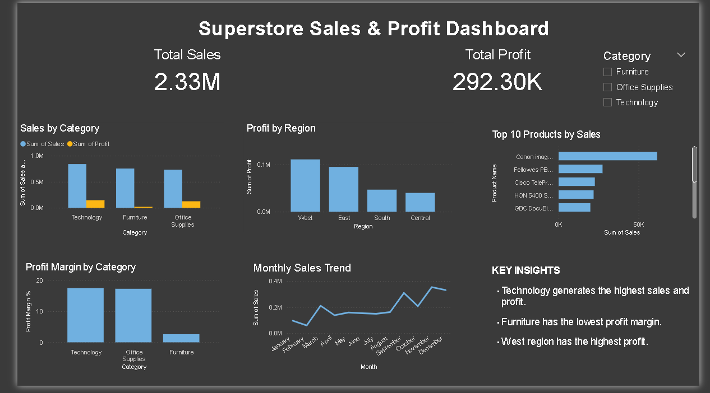

# AI Business Analyst

An interactive **Business Intelligence and Analytics platform** built using **Python, SQL, MySQL, Power BI, AI, and Streamlit** to analyze sales, profit, products, categories, regions, and business trends.

## Live Demo

**Streamlit App:**
https://ai-business-analyst-mahek.streamlit.app/

**GitHub Repository:**
https://github.com/mahekjamdar/AI_Business_Analyst

## Power BI Dashboard

The project includes an interactive **Power BI dashboard** for business performance analysis.



**Power BI File:** `ai_bussines_analyst_dashboard.pbix`

The dashboard covers:

* Sales & Profit
* Orders & Profit Margin
* Regional Performance
* Category & Product Analysis
* Monthly Trends

## Dataset

The project uses a **Superstore-style sales dataset** containing **10,194 records and 21 columns**.

The dataset includes:

* Order & Shipping Information
* Customer & Segment Details
* Region & Location
* Category & Sub-Category
* Sales
* Quantity
* Discount
* Profit

## Features

* Executive Business Dashboard
* Regional Analysis
* Category & Product Analysis
* Monthly Sales & Profit Trends
* AI-powered **Ask the Analyst**
* SQL & MySQL Business Analysis
* Interactive Streamlit Application

## How It Works

The project follows an end-to-end business analytics workflow:

**Business Data → MySQL → SQL Analysis → Python → AI Analyst → Power BI / Streamlit → Business Insights**

* Business sales data is stored and queried using **MySQL and SQL**.
* Python is used for data analysis and application logic.
* The **Ask the Analyst** feature allows users to ask business questions and receive data-driven insights.
* Power BI provides an interactive dashboard for business performance analysis.
* Streamlit provides an interactive web application for accessing the analytics.

## Tech Stack

**Python | Pandas | SQL | MySQL | Power BI | Plotly | Streamlit | AI | GitHub**

## Project Structure

```text
AI_Business_Analyst/
├── app.py
├── ai_analyst.py
├── analyst.py
├── database.py
├── requirements.txt
├── README.md
├── ai bussines dashboard.pbix
└── Ai_bussiness_analyst.png
```

## Example Questions

```text
Which region has the highest profit?
What is the profit margin?
Which category has the highest profit?
What is the highest sales month?
```

## Run Locally

```bash
pip install -r requirements.txt
streamlit run app.py
```

## Objective

To build an **end-to-end Business Analytics solution** that transforms business data into interactive dashboards and actionable insights using **Python, SQL, MySQL, AI, Power BI, and Streamlit**.

## Author

**Mahek Jamadar**

Aspiring Data Analyst | Python | SQL | Power BI | Data Analytics
